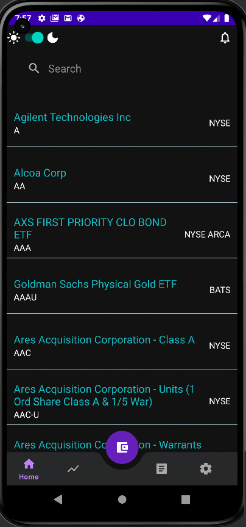
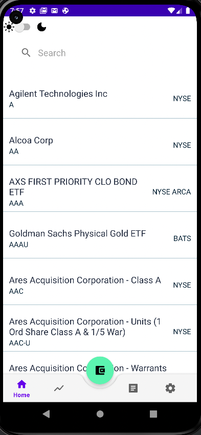
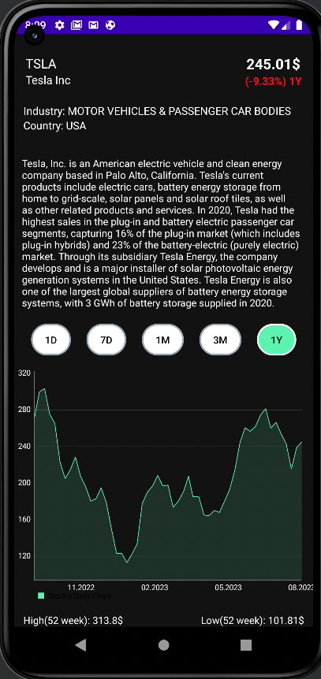
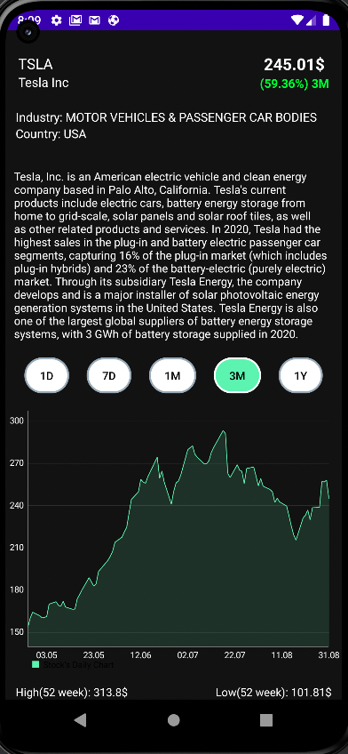
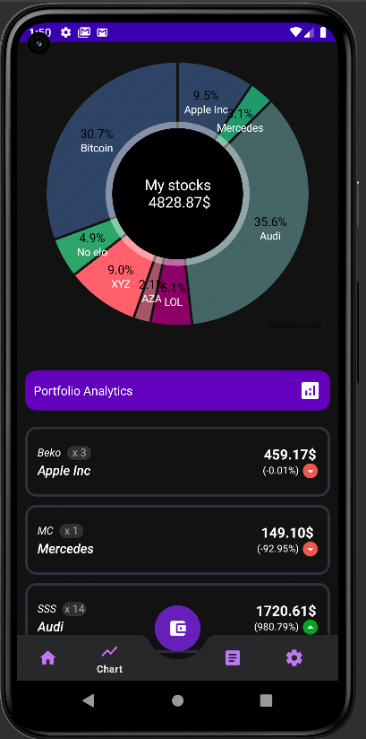
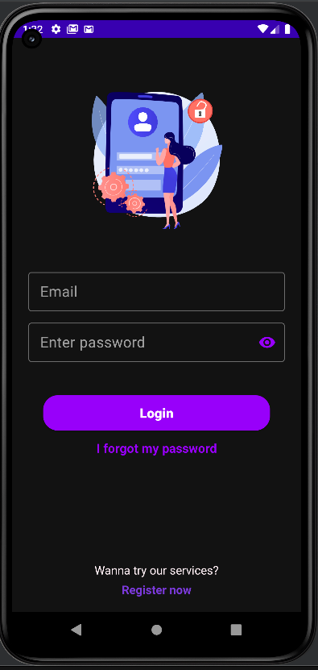

# 📈 Kotlin Stock Mobile App 📱

Kotlin Stock Application for getting data about stocks, viewing stock's prices charts, listing user's stocks and balance

## API used for this project
[Used API](https://www.alphavantage.co/)

## Application presentation:

  

  

  

  

  

  

## Tech Stack
On Frontend:
* Kotlin
* MVVM architecture
* Retrofit for api calls
* Room for local database
* Dagger Hilt for dependency injection
* MPAndroidChart for stock's financial charts
* MotionLayout for viewing stocks in portfolio
* Light/Dark Mode switch
* SharedPreferences for saving token when user has logged in and to avoid another login when user closes app

On Backend:
* Ktor server
* PostgreSQL Local Database for storing users data
* JWT tokens for authentication when logging
* Ktorm ORM library for generating SQL statements
* Routes for login, registration and authentication 

## To be done in future:
* New widgets, entities in the local db
* Functionality of buying some amount of stock(dummy buy with server side code)

## How to run this app on emulator:
1. Clone the project
2. Install Android Studio
3. Create a virtual device via Virtual Device Manager that you want to simulate in Android Emulator or attach your physical Android device
4. Run this app on the emulator